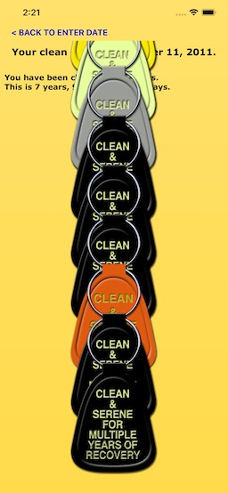
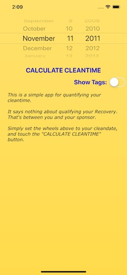
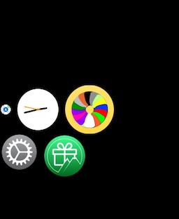
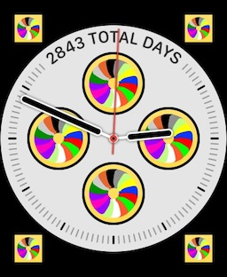
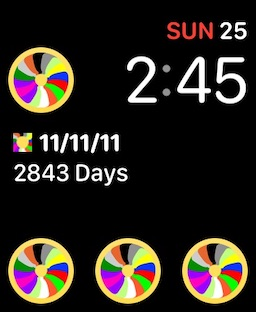
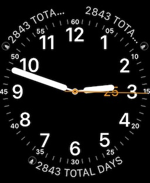
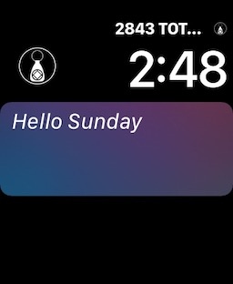
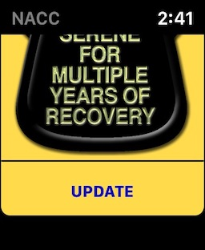

NA Cleantime Calculator (NACC)
=

DESCRIPTION
-
This is an extremely simple [iOS](https://apple.com/ios) app that is designed specifically for use by [NA](https://na.org) members in order to "calculate their cleantime -not their Recovery."
It asks the user to enter the date they got clean, then displays a textual breakdown of their cleantime to date, along with a string of keytags.

REQUIREMENTS
-
This is an iOS app, made for iPhones, iPads and Apple Watches. It is only available via the [Apple iOS App Store](https://www.apple.com/ios/app-store/), and requires [iOS](https://apple.com/ios) 11.0 or above (Requires iPhone 5s or later).

The Watch app requires [watchOS](https://apple.com/watchos) 5.0 or above (Requires a Watch Series 2 or later).

INSTALLATION
-
This will be installed via the Apple App Store, and will be a free app. If you have a compatible Apple watch paired with your phone, then it will also install a Watch App, called "NACC." The Watch app will provide a full complement of complications for all faces.

USAGE (IPHONE)
-
The app is extremely easy to use. Upon opening the app, you will be presented with a screen like this:

Use the date picker to select your cleandate, then tap on the "CALCULATE CLEANTIME" button.

The app will provide a report screen that will look like this (Note that you can scroll the key tags):

 

If you tap on "BACK TO ENTER DATE", at the top, left, you will return to the date entry screen.

You can also choose to have no tags displayed (textual report only). You do this by turning off the "Show Tags" switch, like so:

 

USAGE (WATCH)
-
The Watch app is a "report only" app, that relies on the date that you entered in the paired phone. There is no way to enter a date in the Watch.

The app is available in the "honeycomb", as "NACC", with the "circle of tags" icon:

Complications are available for all Watch faces that support complications:

      

If you activate the app, you will get a report that looks like this (with and without tags):

  

LICENSE
-
MIT License

Permission is hereby granted, free of charge, to any person obtaining a copy of this software and associated documentation
files (the "Software"), to deal in the Software without restriction, including without limitation the rights to use, copy,
modify, merge, publish, distribute, sublicense, and/or sell copies of the Software, and to permit persons to whom the
Software is furnished to do so, subject to the following conditions:

The above copyright notice and this permission notice shall be included in all copies or substantial portions of the Software.

THE SOFTWARE IS PROVIDED "AS IS", WITHOUT WARRANTY OF ANY KIND, EXPRESS OR IMPLIED, INCLUDING BUT NOT LIMITED TO THE WARRANTIES
OF MERCHANTABILITY, FITNESS FOR A PARTICULAR PURPOSE AND NONINFRINGEMENT.
IN NO EVENT SHALL THE AUTHORS OR COPYRIGHT HOLDERS BE LIABLE FOR ANY CLAIM, DAMAGES OR OTHER LIABILITY, WHETHER IN AN ACTION OF
CONTRACT, TORT OR OTHERWISE, ARISING FROM, OUT OF OR IN CONNECTION WITH THE SOFTWARE OR THE USE OR OTHER DEALINGS IN THE SOFTWARE.
